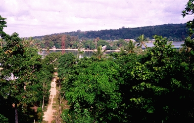

# Multi-CAST Nafsan

## How to cite

If you use these data please cite
- the original source
  > Thieberger, Nick & Brickell, Timothy. 2021. Multi-CAST Nafsan. In Haig, Geoffrey & Schnell, Stefan (eds.), Multi-CAST: Multilingual corpus of annotated spoken texts. Version 2101. Bamberg: University of Bamberg. (multicast.aspra.uni-bamberg.de/#nafsan) (date accessed)
- the derived dataset using the DOI of the [particular released version](../../releases/) you were using



## Description


The **Nafsan** ([sout2856](https://glottolog.org/resource/languoid/id/sout2856)) language, also known as South Efate, is a Southern Oceanic language spoken on the island of Efate in central Vanuatu. As of 2005, there are approximately 6 000 speakers of Nafsan living in coastal villages from Pango to Eton. A [description of the language](MediaTable#cldf:Thieberger2006_a-grammar-of-South-Efate.pdf) can be found in [Thieberger (2006)](Source#cldf:thieberger2006).

The Multi-CAST Nafsan corpus constitutes a subset of the material collected by Nick Thieberger for his PhD research over three periods of fieldwork in the villages of Eratap and Erakor in South Efate between 1995 and 2000, and during subsequent trips. The entirety of the data has been archived in [PARADISEC](http://catalog.paradisec.org.au/collections/NT1), and can also be accessed via [ANNIS](https://gerlingo.com/language_detail.php?langID=6). See further [Thieberger (2004)](Source#cldf:thieberger2004).

The texts were glossed with GRAID by Nick Thieberger and Timothy Brickell, and subsequently annotated with RefIND by Adrian Kuqi under supervision of Stefan Schnell.

The Multi-CAST Nafsan texts (version 2207) also constitute a part of the [Nafsan data set](https://doreco.huma-num.fr/languages/sout2856) in [DoReCo](https://doreco.huma-num.fr/), which has been time-aligned at the phone level.

This dataset is licensed under a CC-BY-4.0 license

Available online at https://multicast.aspra.uni-bamberg.de/#nafsan


```geojson
{
    "type": "FeatureCollection",
    "features": [
        {
            "type": "Feature",
            "geometry": {
                "type": "Point",
                "coordinates": [
                    168.377,
                    -17.7006
                ]
            }
        },
        {
            "type": "Feature",
            "geometry": {
                "type": "Polygon",
                "coordinates": [
                    [
                        [
                            163.377,
                            -12.700600000000001
                        ],
                        [
                            173.377,
                            -12.700600000000001
                        ],
                        [
                            173.377,
                            -22.7006
                        ],
                        [
                            163.377,
                            -22.7006
                        ],
                        [
                            163.377,
                            -12.700600000000001
                        ]
                    ]
                ]
            }
        }
    ]
}
```


## Corpus counts

Only a small number of basic GRAID symbols are counted:

*Function symbols*
- ⟨0⟩ zero
- ⟨pro⟩ definite pronoun
- ⟨np⟩ full noun phrase
- ⟨other⟩ form not further specified

*Person/Animacy symbols*
- ⟨.1⟩ first person
- ⟨.2⟩ second person
- ⟨.h⟩ third person, human
- ⟨.d⟩ third person, anthropomorphic
- ø third person, non-human

*Function symbols*
- ⟨:s⟩ subject of an intransitive clause
- ⟨:a⟩ subject of a transitive clause
- ⟨:ncs⟩ non-canonical subject
- ⟨:p⟩ direct object
- ⟨:obl⟩ oblique argument
- ⟨:g⟩ goal argument
- ⟨:l⟩ locational argument
- ⟨:pred⟩ predicate
- ⟨:poss⟩ possessive
- ⟨:other⟩ function not further specified

Only basic categories are listed; categories represented by complex symbols with additional
specifiers (e.g. ⟨dem_pro⟩ ‘demonstrative pronoun’) have been subsumed under the more basic
category (e.g. ⟨pro⟩ ‘definite pronoun’). Please refer to the annotation notes for this corpus for
information on all annotated categories, including those not listed here.

| GRAID | ⟨:s⟩ | ⟨:a⟩ | ⟨:ncs⟩ | ⟨:p⟩ | ⟨:obl⟩ | ⟨:g⟩ | ⟨:l⟩ | ⟨:pred⟩ | ⟨:poss⟩ | ⟨:other⟩ | totals |
|:--------------|-------:|-------:|---------:|-------:|---------:|-------:|-------:|----------:|----------:|-----------:|---------:|
| **⟨0.1⟩** | 30 | 46 | 0 | 1 | 0 | 1 | 0 | 0 | 0 | 0 | 78 |
| **⟨0.2⟩** | 24 | 44 | 0 | 2 | 0 | 0 | 0 | 0 | 0 | 0 | 70 |
| **⟨0.h⟩** | 121 | 141 | 0 | 11 | 0 | 0 | 0 | 0 | 0 | 0 | 273 |
| **⟨0.d⟩** | 149 | 98 | 0 | 24 | 0 | 0 | 0 | 0 | 0 | 0 | 271 |
| **⟨0⟩** | 52 | 30 | 0 | 72 | 7 | 0 | 0 | 0 | 0 | 0 | 161 |
| **⟨pro.1⟩** | 11 | 15 | 0 | 10 | 4 | 1 | 0 | 0 | 9 | 0 | 50 |
| **⟨pro.2⟩** | 11 | 6 | 0 | 12 | 4 | 1 | 0 | 0 | 5 | 0 | 39 |
| **⟨pro.h⟩** | 3 | 6 | 0 | 15 | 11 | 3 | 0 | 0 | 37 | 0 | 75 |
| **⟨pro.d⟩** | 9 | 2 | 0 | 3 | 1 | 0 | 0 | 0 | 17 | 0 | 32 |
| **⟨pro⟩** | 9 | 3 | 0 | 25 | 19 | 1 | 10 | 2 | 12 | 4 | 85 |
| **⟨np.1⟩** | 0 | 0 | 0 | 0 | 0 | 0 | 0 | 0 | 0 | 0 | 0 |
| **⟨np.2⟩** | 0 | 0 | 0 | 0 | 0 | 0 | 0 | 0 | 0 | 0 | 0 |
| **⟨np.h⟩** | 34 | 21 | 0 | 49 | 1 | 1 | 0 | 7 | 6 | 1 | 120 |
| **⟨np.d⟩** | 42 | 21 | 0 | 14 | 2 | 1 | 0 | 7 | 5 | 0 | 92 |
| **⟨np⟩** | 60 | 7 | 0 | 179 | 14 | 50 | 38 | 26 | 31 | 52 | 457 |
| **⟨other.1⟩** | 0 | 0 | 0 | 0 | 0 | 0 | 0 | 0 | 0 | 0 | 0 |
| **⟨other.2⟩** | 0 | 0 | 0 | 0 | 0 | 0 | 0 | 0 | 0 | 0 | 0 |
| **⟨other.h⟩** | 0 | 0 | 0 | 0 | 0 | 0 | 0 | 0 | 0 | 0 | 0 |
| **⟨other.d⟩** | 0 | 0 | 0 | 0 | 0 | 0 | 0 | 0 | 0 | 0 | 0 |
| **⟨other⟩** | 0 | 0 | 0 | 0 | 0 | 4 | 2 | 5 | 0 | 0 | 11 |
| | 555 | 440 | 0 | 417 | 63 | 63 | 50 | 47 | 122 | 57 | 1814 |


**Clause boundaries**

| GRAID | count |
|:-----------|--------:|
| **⟨##⟩** | 779 |
| **⟨#⟩** | 233 |
| **totals** | 1012 |


## Corpus metadata

- [Annotation notes](cldf/media/annotation-notes.pdf)
- [Translated texts](cldf/media/translated-texts.pdf)
- [Thieberger2006_a grammar of south efate](cldf/media/Thieberger2006_a-grammar-of-South-Efate.pdf)


## CLDF Datasets

The following CLDF datasets are available in [cldf](cldf):

- CLDF [TextCorpus](https://github.com/cldf/cldf/tree/master/modules/TextCorpus) at [cldf/TextCorpus-metadata.json](cldf/TextCorpus-metadata.json)